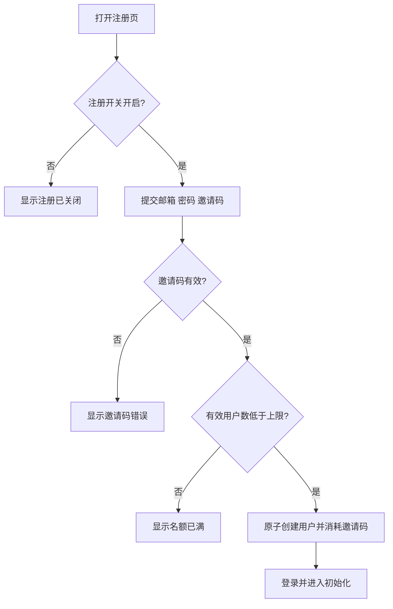
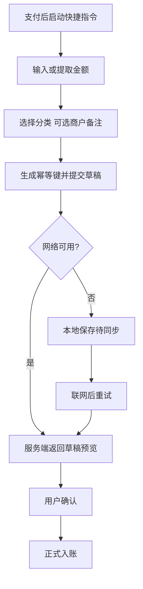
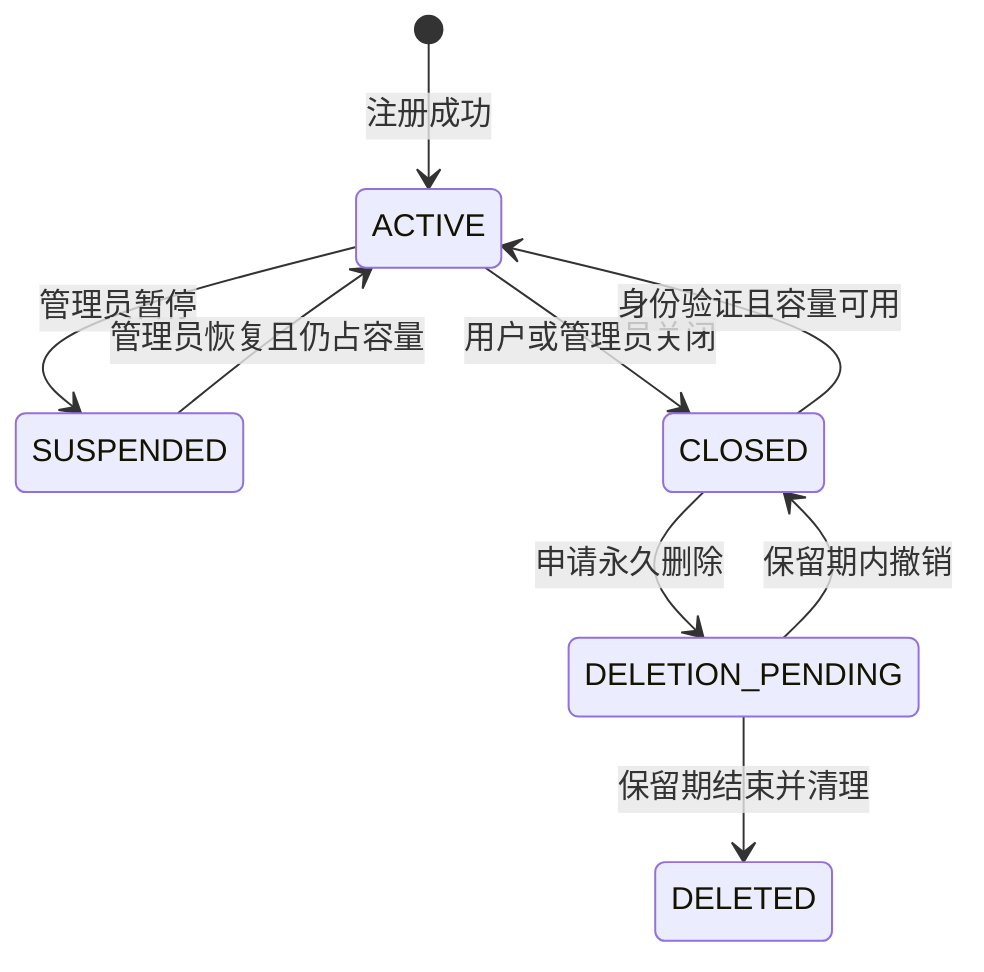

# 02 信息架构与用户流程

文档版本：0.1  
状态：草案  
更新：2026-08-04  
适用版本：V1.0

## 用户端导航

| 一级入口 | 页面 |
| --- | --- |
| 今日 | 今日概览、快速录入、待确认记录、同步状态 |
| 记账 | 账单列表、账单表单、截图识别、预算、统计 |
| 日程 | 日历、日程详情、待办列表、提醒设置 |
| 行程 | 行程列表、行程详情、节点、行李清单 |
| 我的 | 资料、分类账户、快捷指令、设备同步、导出、关闭账号 |

移动端使用底部五项导航和全局“+”；桌面端使用侧边导航和更宽的列表/详情布局。

## 管理端导航

- 仪表盘：有效用户、容量、剩余名额、注册状态。
- 邀请码：创建、撤销、过期、使用记录。
- 用户：状态、容量占用、暂停、关闭、恢复。
- 系统设置：容量上限、注册开关、邀请码开关。
- 审计：管理员操作和高风险操作摘要。
- 运行状态：基础健康状态，不展示用户正文。

## 邀请码注册流程

人数检查、用户创建和邀请码消耗必须处于同一数据库事务。

## 快捷指令记账流程

## 账号关闭与恢复

## 离线同步流程

1. 客户端生成 `clientMutationId` 和本地记录 ID。
2. 本地立即显示记录为 `PENDING_SYNC`。
3. 联网后提交携带服务端已知版本的变更。
4. 服务端按幂等键去重。
5. 无冲突则返回服务器 ID 和新版本。
6. 有冲突则保存本地草稿并返回服务器当前版本，用户选择保留哪一方或手动合并。

## 通用页面状态

所有核心页面必须提供：首次空状态、加载、提交中、成功、字段错误、权限不足、离线、待同步、同步失败、服务不可用和可重试状态。
