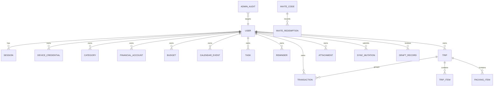

# 05 数据模型与数据字典

文档版本：0.1  
状态：草案  
更新：2026-08-04  
适用版本：V1.0

## 通用约定

- 主键在 API 边界为字符串；数据库可采用 UUID/ULID 字符串。
- 用户资源均含 `userId`，查询必须强制用户范围。
- 金额为 `DECIMAL(18,2)`，币种为 ISO 4217 字符串，V1 默认 `CNY`。
- 时间戳存 UTC，API 使用 ISO 8601；本地日期另存 `DATE`。
- 可同步资源包含 `version`、`createdAt`、`updatedAt`、`deletedAt`。

## 核心关系

## 实体摘要

| 实体 | 关键字段 | 关键约束/索引 |
| --- | --- | --- |
| `User` | email, passwordHash, role, status, closedAt | email 唯一；status 索引 |
| `SystemSetting` | registrationEnabled, inviteRequired, maxActiveUsers | 单例或版本化配置 |
| `InviteCode` | codeHash, status, expiresAt, maxUses, usedCount | codeHash 唯一；状态/过期索引 |
| `InviteRedemption` | inviteId, userId, redeemedAt | userId 唯一；事务内创建 |
| `Session` | userId, refreshTokenHash, expiresAt, revokedAt | token 哈希唯一 |
| `DeviceCredential` | userId, name, tokenHash（唯一）, tokenPrefix, scopes（JSON）, lastUsedAt, revokedAt | 快捷指令凭证仅保存 SHA-256 哈希与展示前缀；scopes 为 ShortcutScope JSON 数组；撤销置 revokedAt |
| `Transaction` | type, status, amount, currency, categoryId, accountId, merchant, occurredAt, note, source, originalTransactionId, isUnlinkedRefund, sourceFingerprint, tripId?, clientMutationId, version, deletedAt | userId+occurredAt；userId+tripId；clientMutationId 唯一；软删除用 deletedAt |
| `Category` | kind（EXPENSE/INCOME）, name, color, isArchived, version | userId+kind+name 唯一；归档而非物理删除 |
| `FinancialAccount` | name, kind（CASH/DEBIT_CARD/CREDIT_CARD/DIGITAL_WALLET/OTHER）, isArchived, version | userId+name 唯一；归档而非物理删除 |
| `Budget` | categoryId?, month（YYYY-MM）, amount, currency, version, deletedAt | userId+month+categoryId 唯一（categoryId 为 NULL 时由服务层校验整体预算唯一） |
| `CalendarEvent` | title, startsAt, endsAt, allDay, status, clientMutationId?, version, deletedAt | userId+startsAt；userId+status+deletedAt；clientMutationId 唯一 |
| `Task` | title, status, priority, dueAt?, completedAt, cancelledAt, clientMutationId?, version, deletedAt | userId+status；userId+dueAt；userId+status+deletedAt；clientMutationId 唯一 |
| `Reminder` | title, note?, targetType, targetId?, scheduleType, startsAt, scheduledAt, recurrenceJson?, status, attemptCount, nextAttemptAt?, sentAt?, suppressedAt?, failureReason?, clientMutationId?, version, deletedAt | userId+status+scheduledAt；userId+deletedAt；status+scheduledAt+nextAttemptAt（调度器）；clientMutationId 唯一 |
| `Trip` | title, destination, startDate, endDate, budgetAmount?, clientMutationId?, version, deletedAt | userId+startDate；userId+deletedAt；clientMutationId 唯一；软删除用 deletedAt |
| `TripItem` | tripId, type（TripItemType）, startsAt, endsAt, location?, position, clientMutationId?, version, deletedAt | tripId+position；tripId+deletedAt；clientMutationId 唯一 |
| `PackingItem` | tripId, text, checked, position, clientMutationId?, version, deletedAt | tripId+position；tripId+deletedAt；clientMutationId 唯一 |
| `Attachment` | userId, ownerType, ownerId, objectKey（唯一）, mimeType, size, sha256, scanStatus, uploadTokenHash（唯一）, uploadIntentExpiresAt, contentStoredAt, deletedAt | 上传意图一次性令牌只存哈希；完成确认前不可用于 OCR |
| `DraftRecord` | userId, source, targetType, payloadJson, confidenceJson, status, clientMutationId（唯一）, attachmentId, failureReason, version, confirmedAt, discardedAt, resultId | 幂等键唯一；确认后 resultId 指向正式记录 |
| `SyncMutation` | userId, clientMutationId, requestHash, resultRef | userId+clientMutationId 唯一 |
| `AdminAudit` | actorId, action, targetType, targetId, beforeJson, afterJson, reason | createdAt；不可从产品 API 删除 |

## 枚举

| 枚举 | 值 |
| --- | --- |
| `UserRole` | `USER`, `ADMIN` |
| `UserStatus` | `ACTIVE`, `SUSPENDED`, `CLOSED`, `DELETION_PENDING`, `DELETED` |
| `InviteStatus` | `ACTIVE`, `EXHAUSTED`, `EXPIRED`, `REVOKED` |
| `TransactionType` | `EXPENSE`, `INCOME`, `REFUND` |
| `RecordStatus` | `DRAFT`, `CONFIRMED`, `DELETED` |
| `RecordSource` | `MANUAL`, `SHORTCUT`, `OCR`, `TEXT`, `VOICE`, `IMPORT` |
| `CategoryKind` | `EXPENSE`, `INCOME` |
| `FinancialAccountKind` | `CASH`, `DEBIT_CARD`, `CREDIT_CARD`, `DIGITAL_WALLET`, `OTHER` |
| `TaskStatus` | `OPEN`, `COMPLETED`, `CANCELLED` |
| `Priority` | `LOW`, `MEDIUM`, `HIGH` |
| `CalendarEventStatus` | `SCHEDULED`, `CANCELLED` |
| `ReminderStatus` | `SCHEDULED`, `SENT`, `CANCELLED`, `FAILED`, `SUPPRESSED` |
| `ReminderScheduleType` | `ONCE`, `DAILY`, `WEEKLY`, `MONTHLY` |
| `ReminderTargetType` | `CALENDAR_EVENT`, `TASK`, `STANDALONE` |
| `SyncState` | `SYNCED`, `PENDING_SYNC`, `SYNC_FAILED`, `CONFLICT` |
| `DraftStatus` | `PENDING`, `CONFIRMED`, `DISCARDED`, `FAILED` |
| `ShortcutScope` | `transaction:draft:create`, `finance:summary:read` |
| `AttachmentScanStatus` | `PENDING`, `SCANNED`, `FAILED` |
| `AttachmentOwnerType` | `TRANSACTION_DRAFT` |
| `DraftTargetType` | `TRANSACTION` |
| `TripItemType` | `TRANSPORT`, `STAY`, `ACTIVITY`, `FOOD`, `OTHER` |

## 容量计算

数据库事务内执行带锁的系统配置读取，并计算 `User.status IN (ACTIVE, SUSPENDED)`。不得用前端展示数字或最终一致缓存决定是否允许注册。

## 删除与保留

- 普通业务记录先软删除并参与同步墓碑处理。
- 账号进入 `DELETION_PENDING` 后禁止登录，期满执行异步分批清理。
- 审计日志只保留最小必要信息并脱敏，不保存账单、日程或行程正文快照。

## WP3 补充说明（2026-08-05）

- `CategoryKind` 与 `FinancialAccountKind` 的取值由 WP3 实现按 V1 基础记账场景补充，属 `[关键假设]`（见 `docs/decisions.md` DEC-112），待产品确认。
- 账单金额一律 `DECIMAL(18,2)`，API 使用两位小数字符串；退款使用 `REFUND` 类型与正金额，必须引用原支出账单或标记 `isUnlinkedRefund=true`。
- 统计只计入 `status=CONFIRMED` 且 `deletedAt IS NULL` 的记录；月预算按 `Asia/Shanghai` 自然月（月份字符串 `YYYY-MM`）计算，退款冲减支出。
- 分类与账户使用 `isArchived` 归档，不物理删除；预算使用 `deletedAt` 软删除。

## WP4 补充说明（2026-08-05）

- 设备凭证明文只在创建响应中展示一次；数据库只存 SHA-256 哈希与 8 位展示前缀；
  `scopes` 使用 JSON 数组保存 `ShortcutScope` 字符串（冒号值不适合 MySQL ENUM）。
- 草稿确认在单个数据库事务内将 `DraftRecord` 标记为 `CONFIRMED` 并创建
  `CONFIRMED` 交易，保留 `source` 与 `clientMutationId`；未确认草稿不计入任何统计。
- 附件采用“短期上传意图 + 一次性 uploadToken（只存哈希）+ 完成确认”流程；
  扫描未通过或内容未存储时不可用于 OCR；本地临时存储写入
  `apps/api/.local-storage`（gitignored）。
- 批量丢弃/清空草稿为高风险操作：先获取短期确认令牌，二次确认后执行并写
  `AdminAudit`（action=`DRAFT_BATCH_DISCARD`）。

## WP5 补充说明（2026-08-05）

- `CalendarEventStatus`（SCHEDULED/CANCELLED）、`ReminderTargetType`（含 STANDALONE）
  与提醒 `title`/`note` 字段为 `[关键假设]`（见 `docs/decisions.md` 与
  `.project/decisions.md` WP5 ADR），待产品确认。
- 日程：`endsAt` 不得早于 `startsAt`；全天事件必须使用 `Asia/Shanghai` 本地午夜边界
  （endsAt 为次日后边界，左闭右开）；时间重叠只返回 `overlapWarning`，不阻止创建/修改。
- 待办：`OPEN`/`COMPLETED`/`CANCELLED` 为持久状态；`overdue` 是计算状态（仅
  `OPEN` 且 `dueAt` 早于 `Asia/Shanghai` 当前时刻），不单独持久化；完成/取消写入
  `completedAt`/`cancelledAt`。
- 提醒：`recurrenceJson` 保存 `{ interval?, weekdays?, dayOfMonth?, until? }`，
  `scheduledAt` 恒为下一次应发送时间；调度器以 `attempt_count`/`next_attempt_at`/
  `last_attempt_at` 做原子领取与失败重试（上限 3 次），账号 `CLOSED`/`SUSPENDED`/
  `DELETION_PENDING` 时标记 `SUPPRESSED` 且不发送。
- 三个资源均支持软删除/恢复、`version` 乐观并发与 `clientMutationId` 幂等，沿用
  Finance/草稿的同步资源约定（为 WP7 同步落地保持语义一致）。

## WP6 补充说明（2026-08-06）

- 新增 `Trip`、`TripItem`、`PackingItem` 三张表与 `TripItemType`
  （TRANSPORT/STAY/ACTIVITY/FOOD/OTHER）枚举；`TripItemType` 取值属
  `[关键假设]`（见 `docs/decisions.md` DEC-121），待产品确认。
- 行程日期使用 `DATE` 语义（`Asia/Shanghai` 本地日期），结束日期不得早于开始日期；
  节点 `startsAt`/`endsAt` 为 ISO 8601 时间，原则上应在行程日期范围内，超范围时
  未确认不保存、确认后保存并返回 `TripItemOutOfRangeWarning`。
- `transactions.trip_id` 为可空外键（ON DELETE SET NULL），仅允许关联当前用户
  未删除的行程；行程实际支出只统计 `status=CONFIRMED` 且未删除的 EXPENSE 减 REFUND，
  由服务端定点计算，前端不自算累计。
- 行程/节点/行李均支持软删除/恢复、`version` 乐观并发与 `clientMutationId` 幂等，
  与 WP3–WP5 同步资源约定一致（为 WP7 同步落地保持语义一致）。
- 未提供批量删除/清空节点或行李端点（`docs/06` 未声明）；如后续新增，须按
  BR-AI-004 二次确认并写脱敏审计（沿用 WP4 `confirmationToken` 模式）。
