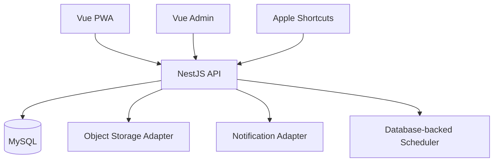

# 07 技术架构与安全

文档版本：0.1  
状态：设计建议  
更新：2026-08-04  
适用版本：V1.0

## 技术栈

- Monorepo：npm workspaces。
- 用户端：Vue 3、TypeScript、Vite、Pinia、Vue Router、PWA。
- 管理端：Vue 3、TypeScript、Vite、Element Plus。
- 后端：NestJS 单体、TypeScript。
- 数据：MySQL 8.x，ORM 建议 Prisma。
- 契约：OpenAPI 3.1 + 生成/共享 TypeScript 类型。
- 测试：Vitest（前端/共享）、后端单元与集成测试、Playwright 浏览器测试。

## 逻辑架构

## 后端模块

- `auth`：账号密码登录、会话、改密（管理员创建/重置，首登强制改密）。
- `users`：账号状态、关闭、恢复、删除。
- `capacity`：容量配置、容量锁和计数。
  - `finance`：账单、分类、账户、预算、统计。
  - `calendar`：日程 CRUD、时间校验、重叠提示。
  - `tasks`：待办 CRUD、状态机与过期计算。
  - `reminders`：提醒 CRUD、重复展开与调度器。
- `drafts`：文本解析/快捷指令草稿及确认。
- `calendar`、`tasks`、`reminders`。
- `trips`。
- `attachments`。
- `sync`：变更游标、幂等和冲突。
- `admin`、`audit`、`health`。
- `integrations`：外部服务适配器。

## 客户端离线架构

- IndexedDB 保存用户范围内的近期业务数据、同步游标和待发送变更。
- 本地记录以用户 ID/账号隔离；退出或关闭账号清除可解密本地数据与凭证。
- Service Worker 缓存应用外壳，不缓存认证响应或跨用户敏感 API 响应。
- 同步器按创建顺序重试，采用指数退避并允许用户手动重试。
- 版本冲突进入专门页面，不在后台静默覆盖金额、日期、状态和删除。
- 服务端变更流为 `(updatedAt, id)` 键集游标聚合，不引入消息队列或事件总线；
  客户端以 IndexedDB 游标/待发送队列 + `POST /sync/mutations` 幂等批量落地
  （WP7 已实现，见 `docs/24-wp7-acceptance-report.md`）。
- 断网刷新时进入「离线会话」模式：不持有 access token，但仍可从本地缓存
  读取业务数据；恢复联网后先刷新令牌再推送队列（401 自动重试）。

## 安全基线

- 密码使用 Argon2id 或平台认可的强哈希参数。
- 刷新令牌只存哈希，并支持单设备撤销和全量撤销。
- 登录、改密和快捷指令端点限流。
- DTO allow-list 校验，禁止批量赋值越权字段。
- 数据访问服务统一要求 `userId`；跨用户访问对外返回 404。
- 管理端单独授权守卫，所有写操作记录审计。
- CORS 精确配置；生产强制 HTTPS、安全头和安全 Cookie 属性。
- 文件限制 MIME、扩展名、魔数和大小；对象键随机生成；上传完成后附件方可使用。
- 日志禁止记录密码、令牌、账单正文、图片内容和账号明文。

## 容量并发策略

管理员创建账号的事务锁定单例容量配置行，再计算占用用户并创建用户。数据库隔离级别、
唯一约束和重试策略必须通过“两个请求争抢最后一个名额”集成测试。

## 提醒调度

V1 使用数据库记录加单进程周期扫描；领取任务时使用原子状态更新避免重复发送。
`reminders` 表以 `attempt_count`/`next_attempt_at`/`last_attempt_at` 支撑领取与
失败重试（上限 3 次，退避 60 秒）；账号 `CLOSED`/`SUSPENDED`/`DELETION_PENDING`
时标记 `SUPPRESSED` 且不发送。多实例部署前必须引入数据库租约或等价互斥，
不直接增加消息队列。调度周期由 `REMINDER_SCHEDULER_ENABLED=true` 开启，
间隔与重试上限可通过环境变量调整。

## 通知适配器

`NotificationAdapter` 接口（`send({ userId, title, body?, scheduledAt })`）由
`IntegrationsModule` 提供本地假实现（`FakeNotificationAdapter`，可注入
`FAKE_NOTIFICATION_FAIL=true` 模拟失败）。无推送权限时保留应用内提醒，前端显示
“通知未开启”；真实 Web Push/系统通知通道按供应商接入（OPEN-005）。

## 可观察性

- 结构化脱敏日志和请求 ID。
- 指标：登录失败、容量拒绝、同步失败、提醒失败、HTTP错误率。
- 健康检查区分存活与就绪，不泄露依赖凭据或内部错误。
