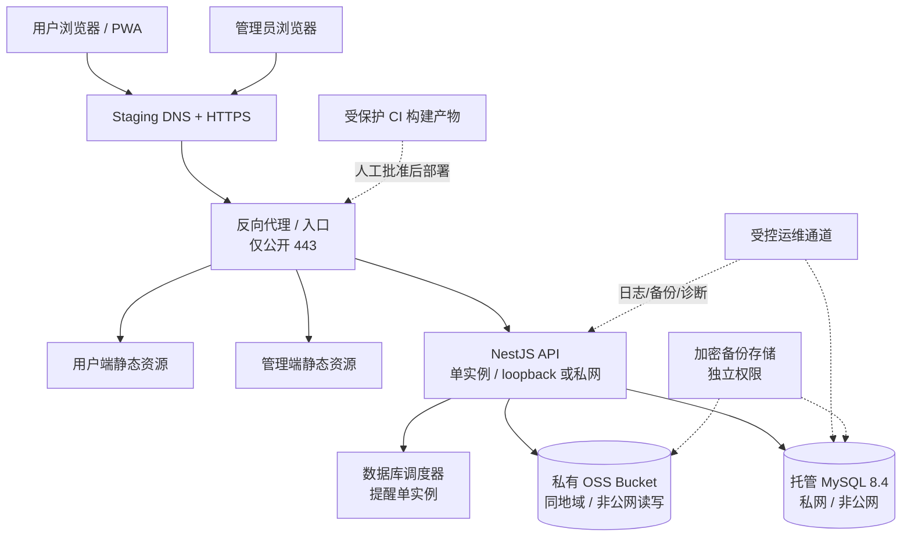

# REL-01 Staging 架构、资源与发布边界设计稿

文档版本：0.1
状态：`REFERENCE_DESIGN / REL-02_SEPARATE_STAGING_WAIVED`

> 2026-09-08 范围更新：用户明确决定不创建独立 Staging。本文保留为未来公开发布、扩容或承载重要真实数据时的参考设计；当前使用现有 Alibaba 私有预览作为验证环境，并执行轻量 REL-03 readiness 与发布流程收口。
更新：2026-09-02
适用版本：V1.5

> 本文的 D1-D8 推荐值已由 `REL-01-DECISION-RECORD-01` 批准；本文仍不是资源创建授权、部署授权或生产发布批准。
> 本轮不创建云资源、域名、DNS、Bucket、数据库、凭据或外部服务，也不写入真实记录。
> 即使本稿已获人工批准，在 R1 Quality Gate 通过且 REL-02 获得独立资源授权前，也不得按本文创建 Staging。

## 1. 文档目标与信息性质

REL-01 的目标是冻结 Staging 的架构、资源选择、成本和权限边界、MySQL/OSS/域名方案、
RPO/RTO、部署拓扑、发布顺序及回滚约束，为 REL-02 和 REL-03 提供可执行输入。

本文使用以下标记：

- `[现状事实]`：已经由仓库、Git 或现有验收证据确认的内容。
- `[设计建议]`：本稿提出并已由 `REL-01-DECISION-RECORD-01` 批准的方案；实际执行仍受 REL-02 前置条件约束。
- `[关键假设]`：为继续设计而采用的保守假设；假设不成立时需重新评估成本、权限或迁移路径。
- `[待确认]`：资源创建前仍需确认的执行细节、具体负责人或实现记录；未确认前不得创建资源或宣称 Staging 就绪。

## 2. 当前基线与范围边界

### 2.1 已确认的现状

| 项目 | 现状事实 |
|---|---|
| 运行形态 | 一个 NestJS API、一个 Vue 用户端、一个 Vue 管理端、一个 MySQL 数据库和对象存储适配层。 |
| 目标规模 | 首发约 10 名受邀用户，容量上限可配置；不开放公开注册。 |
| 数据权威 | 云端 MySQL 是同步主副本；浏览器 IndexedDB 只承担缓存、离线队列和冲突工作区。 |
| 存储适配 | `local` 仅用于本地/测试；`NODE_ENV=production` 时必须使用 `oss`，缺配置应启动失败。 |
| 对象存储代码 | 已有 `AliyunOssStorageAdapter`，上传由 API 代理，不要求浏览器直连 OSS。真实 Bucket、RAM 和连通性尚未验证。 |
| 数据库验证 | CI 与本机一次性环境使用 Oracle MySQL 8.4；真实 Staging 尚未创建。 |
| API 健康检查 | 当前 `/api/v1/health` 只返回非敏感存活状态；当前实现不能单独证明 MySQL/OSS 已就绪。 |
| CI/CD | 已有质量、数据库和浏览器 QA 工作流；尚未发现 Staging 部署工作流或资源编排配置。 |
| 当前门禁 | `R1 Quality Gate = BLOCKED / NOT_READY`；H1/H2 正式真机证据仍为 `PARTIAL`，依赖审计仍未通过。 |
| 数据政策 | 本轮不补充真实记录；后续 Staging 也只能使用合成或脱敏演示数据，除非另有明确批准。 |

### 2.2 不在 REL-01 范围内

- 创建或购买云资源、域名、证书、对象存储 Bucket、数据库或监控服务；
- 修改 `apps/api`、Prisma、数据库 migration、同步后端、CI/CD 或部署配置；
- 启用生产 AI、使用真实 Provider 凭据、评测真实用户数据或写入真实业务记录；
- 生产环境架构、生产成本承诺、生产 SLA 或公开试用授权；
- 引入微服务、消息队列、Kubernetes、外部 Feature Flag SaaS 或其他未被用例要求的基础设施；
- 执行 REL-02 资源创建、REL-03 部署/恢复演练或 REL-04 真机/真实服务验收。

## 3. 推荐方案摘要

下表是已由 `REL-01-DECISION-RECORD-01` 批准的推荐基线；`[待确认]` 仅表示资源创建前的执行细节，不表示 D1-D8 决策仍待批准。

| 决策项 | 推荐基线 | 状态与理由 |
|---|---|---|
| 云厂商/地域 | 优先评估与现有 OSS 适配一致的阿里云单地域方案；现有样例使用 `cn-beijing`，但地域仍需确认。 | `[设计建议] [待确认]`。保持部署和对象存储同地域，减少跨地域流量与延迟。 |
| 计算 | 单台 Linux VM/ECS 或等价单实例主机；建议从 2 vCPU/4 GiB 级别作为 Staging 起始规格。 | `[设计建议]`。10–20 名受邀用户的 Staging 不需要多实例；精确 SKU 以供应商报价和压测为准。 |
| Web/API 拓扑 | 一个 HTTPS 反向代理入口，提供 Web/Admin 静态资源并转发 `/api/v1` 到同机单个 NestJS API。 | `[设计建议]`。减少组件数量；API 进程仅监听 loopback 或私网，不直接暴露公网。 |
| 数据库 | 托管 Oracle MySQL 8.4，私网访问，单实例起步；应用账号与 migration/备份账号分离。 | `[设计建议] [待确认]`。优先使用托管备份与恢复能力；不能使用公共数据库地址。 |
| 对象存储 | 私有 OSS Bucket，与计算/数据库同地域；关闭公共读写，启用版本/延迟删除或等价恢复保护。 | `[设计建议] [待确认]`。Staging 只放合成附件；运行时账号限制到应用所需对象操作。 |
| 域名 | 预留三个独立来源：用户端、管理端、API；名称只使用待确认的 Staging 子域名。 | `[设计建议] [待确认]`。CORS 精确列出用户端和管理端来源，不使用通配符。 |
| TLS/入口 | HTTPS 终止在反向代理或托管入口，强制 HSTS；证书自动续期但私钥不入仓库。 | `[设计建议]`。具体证书服务商不在本轮冻结。 |
| 实例数 | Staging 先保持单 API 实例。提醒调度器只运行一份；多实例前必须增加数据库租约/互斥设计。 | `[设计建议]`。遵守当前单进程 scheduler 约束。 |
| AI | 初始 Staging 默认关闭 live AI；若后续专门验收，只能使用合成数据、独立门禁和服务端凭据。 | `[现状事实 + 设计建议]`。H7 已关闭不等于 Provider enablement 已批准。 |
| 删除清理 | 初始部署保持 `ACCOUNT_DELETION_SCHEDULER_ENABLED=false`，先用受控命令完成 REL-03 演练；验证后再单独批准开启。 | `[设计建议]`。避免首次部署即自动清理测试数据。 |

## 4. 部署拓扑



### 4.1 网络边界

1. 公网只暴露 HTTPS 入口；不直接暴露 MySQL、OSS 或 API 监听端口。
2. API、数据库和 OSS 使用私网或供应商私有端点通信；若供应商不支持同地域私网，必须在 REL-01 审批记录中说明例外及风险。
3. 运维入口使用受控运维通道和最小来源白名单；禁止为方便测试开放 `0.0.0.0/0` 的 SSH、MySQL 或管理接口。
4. 管理端使用独立来源和独立 CORS 白名单；管理端登录仍受管理员权限守卫与脱敏审计约束。
5. API 错误对外只返回 `code/message/requestId`；健康检查不得返回数据库地址、Bucket、版本密钥或内部堆栈。

## 5. 资源与成本边界

### 5.1 资源清单

| 资源 | 最小用途 | 必须具备的控制 | REL-02 前状态 |
|---|---|---|---|
| 计算主机/运行单元 | 反向代理、静态资源、单 NestJS API | 私网网卡、加密磁盘、补丁、最小登录权限、可销毁 | 不存在，不创建 |
| MySQL 8.4 | Staging 业务数据 | 私网、TLS（如供应商要求）、自动备份、独立应用账号、连接告警 | 不存在，不创建 |
| OSS Bucket | 附件和恢复抽样对象 | 私有访问、版本/延迟删除、生命周期、审计、独立 RAM | 不存在，不创建 |
| DNS/证书 | 用户端、管理端、API HTTPS 来源 | 子域名隔离、证书续期、DNS 变更审计 | 未购买/未配置 |
| 日志/指标 | API、数据库、同步、提醒、存储运行观测 | 脱敏、访问控制、保留期、告警 | 未接入 |
| 备份存储 | 加密数据库/对象备份 | 与运行账号分权、恢复点记录、删除保护 | 未建立 |

### 5.2 成本规则

- `[现状事实]` 当前没有已批准的云厂商、地域、SKU、域名和监控供应商，因此不能在本稿中虚构月度价格。
- `[设计建议]` 成本估算应按“计算固定费 + 托管 MySQL 固定费 + 磁盘/备份 + OSS 存储/请求/流量 + 域名/证书 + 日志/监控”拆分，并在创建前记录供应商报价日期、计费周期和是否含税。
- `[设计建议]` Staging 资源应具备费用告警、标签和一键停机/销毁清单；容量或费用不得由系统自动扩大。
- `[待确认]` 需要单独确认 Staging 基础设施的月度费用预算和告警阈值。此前“自然月、暂不固定费用上限”的决定只适用于 ADR-029 的 AI 用量观察，不能自动解释为基础设施费用无限制。
- `[设计建议]` 在没有费用负责人和销毁负责人时，不创建付费资源；测试继续使用 `D:\daily-assistant-runtime` 的本机一次性资源。

### 5.3 供应商选择门槛

选择供应商时至少比较以下项目，并将原始报价或链接留在受控发布记录中，不写入代码：

1. MySQL 8.4 兼容性、私网连接、备份恢复和最小权限；
2. OSS 私有 Bucket、同地域访问、版本/延迟删除和 RAM 前缀权限；
3. 计算单实例的固定费用、磁盘快照和停机计费；
4. 域名 DNS、TLS 证书续期和管理审计；
5. 日志保留、告警和数据驻留位置；
6. 资源销毁、账单导出和异常费用通知。

## 6. 权限与密钥边界

### 6.1 角色矩阵

| 角色 | 允许 | 禁止 |
|---|---|---|
| 产品/验收负责人 | 查看脱敏指标、批准发布窗口和验收结果 | 读取数据库全量正文、查看 Secret、直接修改资源 |
| 基础设施运维 | 创建/配置已批准的 Staging 资源、查看脱敏运行状态、执行备份恢复 | 读取用户业务正文、使用生产凭据、扩大容量或修改生产资源 |
| 部署执行者/CI | 构建并部署指定 commit 的不可变产物 | 读取数据库正文、读取 Secret 明文、绕过人工批准或自动部署生产 |
| API runtime | 读取业务数据库所需表、访问附件对象、写运行日志 | DDL、创建用户、读取备份、列举无关 Bucket、跨用户查询 |
| migration runner | 在发布窗口执行 `prisma migrate deploy` | 长期驻留、处理业务请求、写入未批准的 migration、回滚破坏性 schema |
| backup operator | 生成加密备份、验证恢复点、写入独立备份存储 | 使用 API runtime 凭据、修改业务数据、访问生产备份 |
| OSS runtime | 对应用对象执行必要的 put/get/delete | 公共读写、列举所有对象、读取备份前缀、修改 Bucket 策略 |
| 审计/观测读取者 | 查看脱敏日志、指标和请求 ID | 查看密码、令牌、Cookie、原始账单、附件或 Provider raw response |

### 6.2 凭据规则

- 所有 Secret 只存供应商 Secret 管理能力或 Staging 主机受限文件；不写入 Git、镜像、构建日志、截图或普通日志。
- 数据库 runtime、migration、备份和运维账号必须分离；runtime 账号不授予 DDL 或 `GRANT OPTION`。
- OSS 应用账号只拥有应用所需 Bucket/前缀权限；备份写入使用独立账号和独立前缀。
- API 只读取服务端 Provider 凭据；浏览器不持有 AI、数据库或 OSS 管理凭据。
- 密钥轮换需有负责人、窗口、回滚和旧密钥撤销记录；轮换期间不得把明文写入验收证据。

## 7. 环境配置与功能开关

### 7.1 Staging 初始安全基线

以下是部署时的建议值；不修改当前环境文件，待 REL-02/03 获授权后再生成真实配置：

| 配置 | 建议 |
|---|---|
| `NODE_ENV` | `production` |
| `BUSINESS_TIME_ZONE` | `Asia/Shanghai` |
| `STORAGE_PROVIDER` | `oss`；禁止 `local` |
| `CORS_ORIGINS` | 只包含已批准的用户端和管理端 HTTPS 来源 |
| `REMINDER_SCHEDULER_ENABLED` | `true`，前提是保持单 API 实例 |
| `ACCOUNT_DELETION_SCHEDULER_ENABLED` | 首次部署 `false`；REL-03 受控验证后另行批准 |
| `V15_RRULE_ALLOWED` | `false` |
| `V15_INDEXEDDB_V2_ALLOWED` | `false` |
| `V15_IMPORT_ALLOWED` | `false` |
| `V15_WEB_PUSH_ALLOWED` | `false` |
| `V15_LIVE_PUSH_ALLOWED` | `false` |
| `V15_AI_ALLOWED` | `false`，除非另有合成数据验收授权 |
| `V15_LIVE_AI_ALLOWED` | `false` |
| `V15_INDEXEDDB_CLEANUP_ALLOWED` | `false` |

`V15_*` 缺失、格式错误或不在允许值内均按关闭处理。H7 的 `CLOSED` 只记录本机受控验证和当前阶段决策，不自动打开 `V15_LIVE_AI_ALLOWED`，也不允许把真实 Provider 调用带入 Staging。

### 7.2 与现有样例的兼容说明

- `[现状事实]` `deploy/staging/.env.staging.example` 已存在，但仍使用占位域名、占位凭据和示例 OSS 配置，不能作为已可部署的环境。
- `[现状事实]` `apps/api/src/health/health.controller.ts` 的 `/api/v1/health` 是存活检查，不是完整就绪检查。
- `[设计建议]` REL-03 需要补充“就绪检查如何验证数据库、迁移版本和必要存储依赖”的实现或运维探针；探针必须返回脱敏状态，且不能把管理端权限或凭据暴露给公网。
- `[待确认]` 是否由 API 增加非敏感 readiness 端点，或由受控运维侧组合 `/api/v1/health`、`/admin/health` 和数据库连接检查；该选择属于 REL-03，不在本设计稿中实施。

## 8. 数据、备份与 RPO/RTO

### 8.1 数据使用边界

1. Staging 只使用合成或明确脱敏的测试数据；本轮不添加真实记录。
2. 不从个人设备、生产数据库或真实账单/日程/行程复制数据到 Staging。
3. AI 相关验证如获单独授权，只使用固定合成数据集，保持 `businessWrite=false` 或等价正式写入闸门关闭。
4. 备份、日志、截图和 Playwright 产物不得包含密码、令牌、Cookie、真实账单正文或附件原文。

### 8.2 建议的 Staging 目标

| 对象 | RPO 建议 | RTO 建议 | 说明 |
|---|---:|---:|---|
| MySQL 业务数据 | 不超过 24 小时 | 不超过 4 小时 | 以每日加密备份为最低基线；若选择支持更细粒度恢复的托管能力，可在批准记录中提高目标。 |
| OSS 附件 | 不超过 24 小时 | 不超过 4 小时 | 依赖版本/延迟删除和独立备份；必须抽样验证对象可读。 |
| 应用静态资源/API | 以不可变构建产物为准 | 不超过 1 小时 | 可回退上一份已验收构建；不依赖重新编译现场修复。 |

这些是 Staging 的 `[设计建议]`，不是生产 SLA。生产 RPO/RTO、保留期和合规要求必须在生产发布前单独批准。

### 8.3 备份与恢复操作

1. 每次 migration 或部署前生成加密数据库恢复点，并记录 commit、migration 状态、时间和校验摘要。
2. 数据库备份写入与 runtime 分离的备份存储；备份密钥、数据库 runtime 密钥和运维密钥不得复用。
3. 至少保留一个可恢复的日备份窗口，并保留最近一次发布前恢复点直到发布验收结束；具体保留天数 `[待确认]`。
4. REL-03 在隔离数据库恢复，不覆盖源库；核对用户隔离、软删除/墓碑、同步游标、审计摘要、金额精度和 migration 版本。
5. OSS 抽样恢复至少核对一份合成附件的对象存在性、内容摘要、权限和删除/恢复行为。
6. 破坏性 migration 不作为 Staging 的默认回滚手段；优先应用向前修复。若必须恢复，先停止写入、保留证据并按批准的恢复步骤执行。
7. 恢复完成后执行健康检查、登录、记账、日程、待办、同步、提醒和管理员脱敏页面 Smoke；未通过不得结束恢复窗口。

## 9. 发布、迁移与回滚流程

### 9.1 Staging 发布前置条件

- R1 Quality Gate 已达到可进入 Staging 的状态；当前仍为 `BLOCKED / NOT_READY`，因此不能执行 REL-02。
- REL-01 本稿的供应商、地域、域名、权限、成本、RPO/RTO 已由负责人批准。
- REL-02 已获得独立资源授权，并产生可核验的资源清单、最小权限和销毁方案。
- 使用明确的 integration→Staging commit；不得部署当前未进入批准发布链的任意工作树。
- 所有待部署 migration、环境变量、开关和回滚点已经过发布前审查。

### 9.2 推荐发布顺序

```text
批准的 commit / 构建产物
  → 费用、资源、Secret、CORS、域名和网络 preflight
  → 数据库备份与恢复点记录
  → 迁移 dry-run / 兼容性检查
  → `prisma migrate deploy`
  → API 部署并检查 liveness/readiness
  → Web/Admin 静态资源部署
  → 登录、容量、记账、日程、待办、同步、提醒和管理端 Smoke
  → 备份抽样恢复与监控告警验证
  → 记录发布结果和下一步 REL-04 门禁
```

数据库变更必须先向后兼容 API 和客户端；若旧客户端可能继续在线，不能先删除旧字段或旧状态。客户端离线队列和同步游标不得因发布被重置。

### 9.3 回滚原则

- 应用回滚使用上一份已验证的不可变构建产物，不在服务器上临时改代码。
- 数据库优先向前修复；禁止把未经演练的 `DROP`、不可逆清理或 Shrink 当作常规回滚。
- 若应用回滚与数据库版本不兼容，停止发布并使用备份恢复路径，不强行启动旧应用。
- OSS 使用版本/延迟删除保护附件引用；清理任务不得在发布窗口自动删除尚未验证的对象。
- 回滚后再次执行登录、关键业务读写、同步、权限隔离、健康检查和日志脱敏检查。

## 10. 监控与告警最小集合

| 类别 | 观测 | 告警/动作 |
|---|---|---|
| API | 可用性、5xx、请求延迟、requestId | 连续失败触发值守；不得自动扩容或自动改配置。 |
| 数据库 | 连接数、拒绝、慢查询、存储和备份结果 | 连接耗尽、备份失败、容量不足必须阻止发布。 |
| 同步 | pull/flush 失败、积压、冲突、429 | 先退避和人工复核；不得静默丢弃离线队列。 |
| 提醒 | 调度领取、失败、重试、抑制 | 单实例重复领取或失败率异常时停止发布。 |
| 对象存储 | 上传/下载/删除失败、容量、权限拒绝 | 权限异常立即禁用相关写入并保留失败记录。 |
| 认证/安全 | 登录失败、限流、权限拒绝、审计写入失败 | 只记录脱敏指标；不得输出凭据或业务正文。 |
| 费用 | 资源运行、备份、流量和 OSS 用量 | 超过预设告警阈值通知负责人，不自动扩大预算。 |

## 11. REL-01 完成定义与批准清单

### 11.1 完成定义

REL-01 已通过 `REL-01-DECISION-RECORD-01` 将 D1-D8 推荐值固化为批准决策。以下事项是进入 REL-02 前必须补齐的执行记录，不会被解释为已创建资源或已通过 R1：

1. 云厂商与部署地域形成最终执行记录；
2. 计算、MySQL 8.4、OSS、DNS/TLS、日志/监控和备份的资源参数形成清单；
3. 网络边界、runtime/migration/backup/运维权限形成可审计矩阵；
4. Staging 费用估算、告警阈值、停止和销毁负责人形成记录；
5. Staging RPO/RTO 与备份保留策略形成记录；
6. AI、提醒、删除清理及其他 Feature Flag 初始状态写入受控环境清单；
7. 发布、migration、恢复和回滚顺序完成执行前审查；
8. `/health` liveness 与后续 readiness 实现边界登记；
9. `REL-01-DECISION-RECORD-01` 同步到适用的状态和发布文档；
10. 明确 REL-02 的独立资源授权仍未包含在 REL-01 批准内。

### 11.2 已批准决策与执行前约束

| 编号 | 决策点 | 批准的推荐值 | REL-02 执行前约束 |
|---|---|---|---|
| D1 | 云厂商与地域 | 阿里云同地域优先评估，`cn-beijing` 仅为现有样例 | 创建前记录最终地域、可用区、费用和销毁能力 |
| D2 | MySQL 方案 | 托管 Oracle MySQL 8.4、私网、单实例、账号分离 | 创建前记录规格、TLS/私网、备份和最小权限 |
| D3 | OSS 方案 | 私有同地域 Bucket、版本/延迟删除、RAM 最小权限 | 创建前记录地域、生命周期、恢复和合成附件边界 |
| D4 | 域名/TLS | 用户端、管理端、API 三个 Staging 来源、HTTPS/HSTS、精确 CORS | 创建前记录域名所有权、证书、Cookie/SameSite 和最终来源 |
| D5 | 费用 | 报价拆分、费用告警、停机和销毁负责人 | 创建前记录报价、预算、阈值和销毁路径 |
| D6 | RPO/RTO | Staging RPO ≤24h、RTO ≤4h；静态/API RTO ≤1h | 创建前记录备份频率、保留期、分权和恢复演练方案 |
| D7 | readiness | REL-03 增加非敏感 readiness 或受控组合探针 | 当前 health 仍仅为 liveness；实现归属和失败门槛待记录 |
| D8 | 运行开关 | live AI、Push、RRULE、Import、IndexedDB cleanup 默认关闭；单实例提醒调度；首次关闭账号清理 | 创建前写入受控开关清单，逐项启用仍需独立授权 |

## 12. 后续工作包输入

### REL-02（资源创建）

只有在 REL-01 获批准、R1 Quality Gate 达标并获得独立资源授权后，才能：

- 创建并登记已批准的计算、MySQL、OSS、DNS/TLS、备份和监控资源；
- 验证私网、最小权限、费用告警、Secret 注入和销毁路径；
- 不导入真实记录，不启用生产 Provider，不接触生产资源。

### REL-03（部署、备份、恢复与回滚）

依赖 REL-02 的资源清单，重点完成：

- 可重复部署指定 commit；
- migration 兼容检查；
- liveness/readiness、日志脱敏和告警验证；
- MySQL 与 OSS 隔离恢复；
- 应用回滚和数据库向前修复演练；
- 在合成数据上完成登录、业务、同步、提醒和权限隔离 Smoke。

### 当前不能进入 REL-02/03 的原因

- `R1 Quality Gate` 仍为 `BLOCKED / NOT_READY`；
- H1/H2 正式物理 iPhone 证据仍为 `PARTIAL`；
- 依赖审计仍 fail-closed，尚无通过兼容性、SBOM、license 和发布检查的正式修复；
- 本稿虽已由 `REL-01-DECISION-RECORD-01` 批准 D1-D8 推荐值，但 REL-02 的独立资源/费用授权、具体执行参数和资源验收证据仍不存在。

### 12.1 跨文档一致性自检

本轮按当前仓库事实对本稿进行了只读交叉核对，结果如下：

| 核对项 | 结果 | 说明 |
|---|---|---|
| PLANS.md / ADR-026 任务边界 | PASS | 仅提前冻结设计，不把 REL-01 扩展为 REL-02 资源创建。 |
| `docs/07` / `docs/architecture.md` 拓扑 | PASS | 保持单体 API、MySQL、对象存储适配层和单实例 scheduler，不引入队列或微服务。 |
| `docs/10` / `docs/27` 发布与存储约束 | PASS | 保持 HTTPS、精确 CORS、`STORAGE_PROVIDER=oss`、备份优先和向前修复原则。 |
| `deploy/staging/.env.staging.example` | PASS（占位） | 仅作为变量名和初始开关参考；其中域名、凭据和 OSS 信息仍是占位值，不得直接用于创建资源。 |
| `apps/api/src/health/health.controller.ts` | GAP 已登记 | 当前 `/api/v1/health` 只有 liveness；readiness 由 REL-03 决定并实现。 |
| 真实记录/敏感信息边界 | PASS | 本稿未写入真实记录、凭据、令牌或外部资源标识。 |

自检结论：设计稿内部和与现有规划文档之间没有发现需要立即修正的矛盾；D1-D8 推荐值已批准，readiness、供应商、费用、域名和 RPO/RTO 的具体执行记录仍是 REL-02/REL-03 前置项。该结论不等于 R1 通过或资源创建授权。

## 13. 结论

本稿将现有发布清单中的 Staging 方向整理为一套小规模、单体、最小权限、可恢复且不引入新基础设施类型的设计建议。经 `REL-01-DECISION-RECORD-01` 固化后状态为 `APPROVED / REL-02_AUTHORIZATION_PENDING`；该批准不能解除 R1、H1/H2、OPEN-006 或资源授权门禁。

本轮没有补充真实记录，没有创建资源，没有修改业务代码、API、数据库、同步后端、依赖或部署配置。
