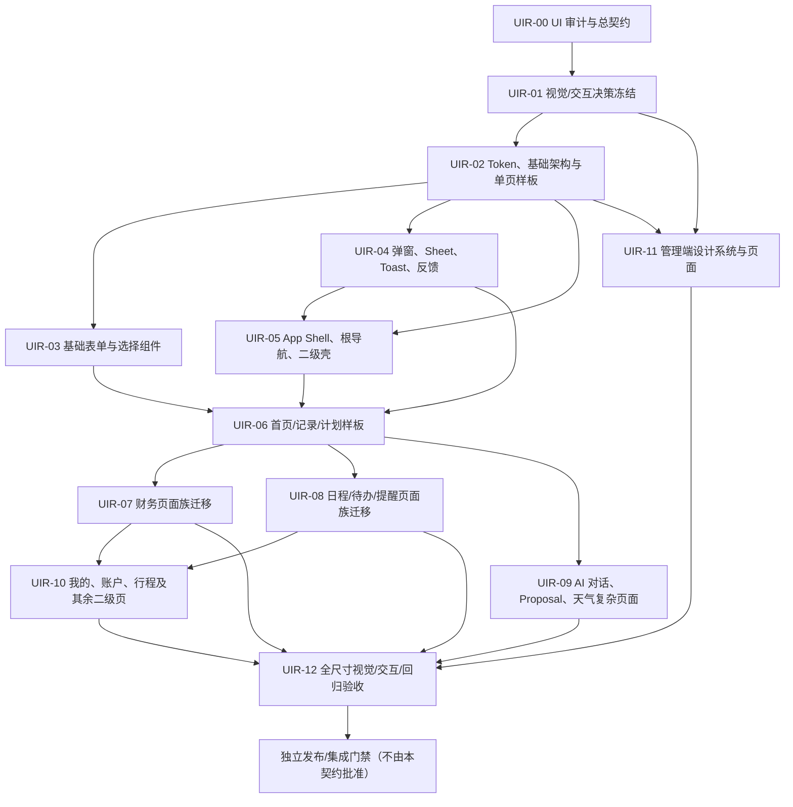

# UIR-00 — UI 重构总契约与分阶段任务图

## Metadata

- Contract：`DAILY_ASSISTANT_UI_RECONSTRUCTION_V1`
- 文档版本：`1.1 / 5.6_SOL_FINAL`
- 状态：`UIR_00_AUDIT_COMPLETE / UIR_01_DECISION_PREPARATION_COMPLETE / IMPLEMENTATION_NOT_STARTED`
- 最后更新：2026-09-15
- 适用版本：Daily Assistant V1.5 UI 重构后续系列
- 分工：`5.6 Sol` 维护 UI/产品/任务契约；`5.6 Luna` 执行每个 bounded implementation task；主代理独立审查 diff 与验证
- 执行器限制：当前不使用 DeepSeek
- 前置实现系列：MOBILE-C3（日期时间控件）
- 当前分支事实：`codex/mobile-c3-date-time-controls`，HEAD `5a0dc529fd9d34a9a2c70788a6d0e87a7745ce2b`

> 这是 UI 重构的总契约和任务图，不是“全部页面立即改造”的授权。UIR-00 实际代码审计和 UIR-01 决策准备已分别记录于 docs/52、docs/53；九项建议尚未自动批准，UIR-02 及其后均未实施业务代码。

## 1. 目标与范围

### 1.1 目标

把用户已经确认的暖白/柔和紫移动优先 UI 基线，分批落实到用户端和管理端；统一 token、基础组件、弹窗/反馈、表单/选择框、日期时间交互、AI 对话展示、天气降级、根页面、二级页面五类排版和管理端骨架，同时保持现有业务行为与项目架构不变。

### 1.2 全局允许范围

每个子任务只能修改其明确列出的路径类别和测试/文档配套，不得因为“UI 重构”扩大到无关业务：

- 用户端 `apps/web/src/components/**`、`apps/web/src/views/**`、`apps/web/src/styles/**`、既有样式入口和对应测试。
- 管理端 `apps/admin/src/components/**`、`apps/admin/src/views/**`、`apps/admin/src/styles/**`、既有样式入口和对应测试。
- 受影响的浏览器测试/测试夹具，只用于验证既有路由和行为。
- UIR 契约允许的 `docs/**`、`tasks/**` 交接和验收证据。
- 若任务确实需要新的天气或 AI API/数据模型，必须先停在决策点，另开获批的契约/适配层任务；不能在普通 UI 子任务中隐式改动 `apps/api/**`、`packages/api-contracts/**` 或 Prisma。

### 1.3 全局禁止范围

- 不修改 API、数据库、OpenAPI、共享业务枚举、认证、权限、同步算法、离线队列、Service Worker、Push、路由语义或发布范围。
- 不引入微服务、消息队列、事件总线、第二套 UI 框架或平行弹窗/日期时间体系。
- 不删除已有功能，不把旧页面的业务逻辑重写成视觉组件，不改变金额、时区、序列化、幂等、冲突和确认语义。
- 不把天气供应商、定位权限、AI 会话持久化、流式协议、消息保留或费用策略当成图稿自动批准的实现内容。
- 不在当前 `codex/mobile-c3-date-time-controls` checkout 开发 UIR 实现；不提交、推送、创建 PR、部署或修改生产资源，除非对应任务另获授权。

## 2. 事实类型与前置门禁

- `[已确认]` 用户端根导航：首页、记录、计划、我的；首页快速记录优先；问候区显示日期/星期/城市/天气，小猫在天气区内，不单占一行；首页不常驻展示“已同步”。
- `[已确认]` AI 有独立对话入口/页面和 Proposal/草稿确认边界；AI 不得未经确认写正式账单、日程、待办或行程。
- `[已确认]` 日期字段使用日历，小时/分钟使用紧凑选择滚轮，不能要求手动输入时间；继续保留 `Asia/Shanghai`、既有值格式和页面校验。
- `[已确认]` 二级页分列表、详情、编辑、复杂详情、设置五类；管理端继续 Vue Element Plus 的侧栏 + 顶部上下文 + 表格 + 详情抽屉。
- `[现状事实]` 本地当前分支已包含 PR #33 merge commit `5a0dc529...`；该 commit 的父提交为 Integration `e4b6567...` 和 PR 功能提交 `a237950...`。本地 remote-tracking Integration 也包含该 merge commit，但这不是未来实施时的新鲜远端核验。
- `[已归一]` canonical 状态文件已按实时 GitHub/CI 证据记录 PR #33 为 `MERGED / DONE_INTEGRATION / CI_PASS`；`tasks/MOBILE-C3.md` 保留为当时执行契约快照，不作为实时状态总账。
- `[现状事实]` `docs/50` 和 `docs/51` 是本契约的设计基线；当前未完成任何 UIR 业务实现。
- `[审计事实]` `docs/52-ui-current-state-audit.md` 已覆盖实际路由、页面、原生控件、公共组件、状态、返回、测试和 CSS 差距；`docs/53-ui-open-decisions.md` 已形成九项待签收建议。
- `[任务输入]` `tasks/UIR-02.md` 已冻结 Luna 的精确文件白名单、禁止项、行为保留、测试和五档验收；开始实现仍须满足第 2.2 节实时基线与独立分支门禁。

### 2.1 角色与交付责任

| 角色 | 必须负责 | 不得替代 |
|---|---|---|
| 5.6 Sol | 编写/维护 UI 产品基线、每个任务契约、决策状态和越界判断 | 不把草图或未决能力写成已批准 API/实现 |
| 5.6 Luna | 按已冻结的单个 bounded implementation task 修改允许文件并产出测试证据 | 不自行扩展产品、API、数据库、权限或发布范围 |
| 主代理 | 开始前核验基线；完成后独立审查 diff、运行/核对测试、判定验收和升级未决问题 | 不以 Luna 的完成消息代替代码审查和验证 |

每次只执行一个边界明确的实现任务。即使依赖图显示多个页面族已就绪，也不得自动并行或连续推进；每个任务开始前由 Sol 校准该任务契约，完成后由主代理验收。当前不使用 DeepSeek。

### 2.2 开始第一项实施任务的硬门禁

UIR-02 及其后的任何代码实现，必须同时满足：

1. 通过实时 GitHub/Git 重新核验 MOBILE-C3 已实际存在于当时的 Integration HEAD；不能只依据本地 ancestry、remote-tracking ref 或 `tasks/MOBILE-C3.md` 的旧快照。
2. 记录新鲜的 Integration HEAD、PR #33 merge 状态、合并后 CI 结果和现有设备验收证据；若冲突，以实时事实为准并暂停受影响动作。
3. 本轮规划/状态提交必须已经进入 Integration，或用户另行明确授权以该精确本地提交 SHA 作为实现基线；两者均不满足时返回 `UIR-02_BLOCKED_PLANNING_NOT_IN_INTEGRATION`，不得创建分支或调用 Luna。
4. 按已满足的门禁路径从包含规划提交的 Integration 或获授权的精确本地 SHA 新建独立 UIR 分支（建议命名 `codex/ui-reconstruction-*`），并确认工作区没有需要覆盖的未知修改。
5. 先完成 UIR-00 只读审计/页面矩阵和 UIR-01 决策冻结，再开始 UIR-02；不得直接从视觉稿跳到全量页面迁移。
6. UIR-02 是第一项代码任务，只能建立 token、样式/组件基础架构与一个低风险样板页；样板未通过不得迁移页面族。
7. 实现由 `5.6 Luna` 执行，主代理独立审查与验证；任务契约和产品决策继续由 `5.6 Sol` 维护。

若 MOBILE-C3 未合入、实时状态无法确认或规划基线交付门禁未满足，UIR 只能保持规划和只读审计，不能改动业务代码。

## 3. 依赖任务图

任务关系说明：UIR-07、UIR-08 和已完成独立 AI/天气决策前置的 UIR-09 在 UIR-06 通过后具备按页面族选择的依赖条件；UIR-10 必须等待 UIR-07 与 UIR-08 都通过。所有任务仍一次只执行一个；共享组件缺陷必须回到 UIR-03/04/05 的允许范围修复。UIR-11 必须同时完成 UIR-01 决策冻结并通过 UIR-02 的 token 语义与验收方法后才具备开始条件；管理端仍须遵守权限与容量不变量。UIR-12 只有所有纳入范围的页面族完成后才能开始。

## 4. 子任务契约

下面每项均包含目标、允许路径类别、禁止范围、交付物、验收条件和验证方式。路径类别不是自动授权，执行时仍需先查看工作区实际修改并遵守具体任务的文件白名单。

### UIR-00 — UI 全量基线审计

- 目标：只读盘点用户端/管理端路由、页面类型、原生控件、弹窗、反馈、空/错/离线状态、设计变量和现有测试，建立页面—功能—组件矩阵。
- 依赖：仅需完成本契约规定的 MOBILE-C3 实时状态核验；只读审计可在代码分支创建前完成，但不得修改当前承载 merge commit 的 checkout 或其他业务实现。
- 允许路径类别：`docs/50*`、`docs/51*`、`tasks/UIR-00.md`、必要的只读报告或测试输出；若仅为审计记录，可不改代码。
- 禁止范围：所有 `apps/**` 业务代码、API/数据库、路由和状态；不把概念图直接转成组件。
- 交付物：页面矩阵、原生控件清单、重复样式/弹窗清单、保留业务行为清单、五档尺寸截图/测试基线建议、阻塞决策清单。
- 验收条件：所有现有路由有归类；每个写操作有原交互与目标交互；明确视觉变化与行为变化；天气/AI 不能用 UI 图掩盖接口决策。
- 验证矩阵：用户端/管理端 × 路由/页面/组件 × 成功/空/加载/错误/离线/权限/冲突 × 当前/目标交互；只读 `rg`/路由检查、文档交叉检查、`git diff --check` 和 `npm run check:context`。本任务不把五档浏览器建议记为已通过。

### UIR-01 — 视觉与交互决策冻结

- 目标：将 50/51 的基线转成实施前确认表，冻结颜色方向、根导航、桌面布局、密度、弹窗形态、AI/天气的产品决策。
- 依赖：UIR-00。
- 允许路径类别：`docs/50*`、`docs/51*`、`docs/README.md`、UIR 任务契约和视觉验收说明；不改业务代码。
- 禁止范围：不由 Luna 自行改变产品范围；不批准天气供应商、定位、AI 会话持久化、后端接口或数据库。
- 交付物：决策表、签收的样板页面范围、未决项责任人/前置条件、更新后的 UI 验收标准。
- 验收条件：每个会改变成本、隐私、API 或迁移路径的决策有明确状态；未确认项不写成完成；与现有架构和产品不变量无冲突。
- 验证矩阵：已确认/待确认/禁止/待归一 × 产品/隐私/API/数据/成本/发布责任人；文档链接/编号检查、`npm run check:context`、`git diff --check`。

### UIR-02 — 用户端 Token、UI 基础架构与单页样板（首个代码任务）

- 目标：建立颜色、排版、间距、圆角、阴影、层级、动效、密度、主题和 slots 的用户端基础架构，并用一个低风险页面证明迁移方式；不直接全站迁移。
- 依赖：UIR-01；且满足第 2.2 节 Integration/分支门禁。
- 允许路径类别：`apps/web/src/styles/**`、用户端既有样式入口、必要的 UI foundation 组件、`apps/web/src/views/ChangePasswordView.vue`、对应样式/组件/页面测试、`docs/51*` 实现注记。
- 禁止范围：不改管理端页面（归 UIR-11），不重写页面业务结构，不改路由/API/Store/数据库，不引入第二套 UI 框架；不批量迁移页面，不删除现有可用样式而无迁移路径。
- 交付物：token 文件/层级、主题与 compact/comfortable 密度入口、header/filter/status/action slot 契约、桌面 max-width 基础、`ChangePasswordView` 单页样板、迁移检查表。
- 验收条件：新增样式只使用语义 token；样板页保持原提交/未保存/错误行为；现有日期时间、弹窗和导航不被破坏；375/390/430/768/1440 的样板与基础容器无溢出；主题变量有默认回退。主代理签收前不得开始 UIR-03 或扩大页面范围。
- 验证矩阵：375/390/430/768/1440 × 默认/compact/200% 文本 × 正常/错误/加载/离线 × Browser Back/焦点/控制台/网络失败；用户端格式、lint、typecheck、组件/样板页测试、`git diff --check`，共享入口变更必须运行 `npm run quality`。

### UIR-03 — 基础表单、按钮、选择和字段组件

- 目标：统一 Button、IconButton、FormField、TextField/TextArea、AmountField、Select、Checkbox/Radio、SegmentedControl，并复用现有日期/月/日期时间字段。
- 依赖：UIR-02。
- 允许路径类别：`apps/web/src/components/**`、`apps/web/src/styles/**`、对应单测和渲染夹具；日期组件通常只做样式/可访问性兼容，但 `TemporalPickerField` 明确允许把现有小时/分钟文本输入替换为已确认的紧凑滚动选择，并更新对应 unit 与既有 E2E helper。管理端组件留给 UIR-11。
- 禁止范围：不改变 `v-model` 值类型、`YYYY-MM-DDTHH:mm` 格式、API 字段、业务校验、路由和数据序列化；不把文本输入替换为无法验证的自定义控件；不新增日期时间库。
- 交付物：状态完整的基础组件、键盘/读屏测试、错误/禁用/loading 样例、一个简单页面的迁移示例。
- 验收条件：label/help/error/required 一致；触控尺寸 44–48px；Select 可键盘操作；小时/分钟使用可点击、可上下滚动且支持键盘的紧凑选择，不再展示文本输入框；取消恢复原值、确认写回既有格式、min/max 和页面关系校验保持；重复提交被阻止；现有页面行为保持。
- 验证矩阵：375/390/430/768/1440 × default/focus/disabled/loading/error × 键盘/触控/读屏 × 重复提交/长标签/清除；TemporalPicker 另覆盖 00/23 小时、00/59 分钟、滚动/点击/键盘、取消/确认、跨日、min/max 和现有 E2E 页面；组件与受影响样板页单测、typecheck/lint、`git diff --check`。

### UIR-04 — 弹窗、Action Sheet、Toast 和反馈体系

- 目标：在既有 `AppDialog` 上统一确认弹窗、短表单、Action Sheet、Toast、Empty/Error/Loading 状态和焦点/滚动策略。
- 依赖：UIR-02；表单内容接入需 UIR-03。
- 允许路径类别：`apps/web/src/components/**`、既有 dialog/confirm 服务、`apps/web/src/styles/**`、对应测试；管理端同语义适配留给 UIR-11。
- 禁止范围：不保留或新增平行 `window.confirm/alert`（浏览器离开页面安全提示除外）；不改变业务确认条件；不把 Toast 当正式持久化结果。
- 交付物：ConfirmDialog、FormDialog/FullscreenEdit、ActionSheet、Toast 规范与测试；现有调用点迁移清单。
- 验收条件：焦点进入/恢复、Tab 约束、Escape、遮罩策略、滚动锁定、安全区、长内容和错误恢复均可验证；危险操作仍有审计边界。
- 验证矩阵：375/390/430/768/1440 × Confirm/Form/Sheet/Toast × 打开/取消/确认/失败/长内容 × Escape/Tab/焦点恢复/滚动锁定/Back/软键盘；组件与调用点回归、控制台/网络失败、`git diff --check`。

### UIR-05 — App Shell、根导航和统一二级壳

- 目标：落实四个根导航和二级页统一标题栏、返回、底部导航/桌面适配、页面 max-width、固定底部操作区。
- 依赖：UIR-02、UIR-04；导航行为必须兼容 MOBILE-A。
- 允许路径类别：`apps/web/src/App.vue`、导航/壳组件、布局样式、既有路由元信息的显示层、对应测试；不改路由语义。
- 禁止范围：不删除既有入口、不改变 Browser Back/系统返回/深链接 fallback、不把 AI 强行作为第五根导航、不改变权限守卫。
- 交付物：RootShell、SecondaryPageShell、四项根导航、桌面/移动布局、空/错误/离线壳状态。
- 验收条件：首页/记录/计划/我的稳定可达；深层二级页隐藏根底部导航；返回不堆历史；375/390/430/768/1440 无溢出；焦点和安全区通过。
- 验证矩阵：375/390/430/768/1440 × 四根页/直接深链/二级页 × Browser Back/系统返回/应用内返回 × 空/错误/离线/安全区；导航单测、五档 E2E、共享入口受影响时 `npm run quality`、`git diff --check`。

### UIR-06 — 首页、记录、计划三个样板页面

- 目标：先实现三页样板验证信息层级：首页问候/天气/小猫/快速记录/AI 入口，记录列表，计划摘要/时间线。
- 依赖：UIR-03、UIR-04、UIR-05。
- 允许路径类别：指定的 `apps/web/src/views/HomeView.vue`、记录/计划根页、样板所需组件和测试/样式；不得一次迁移其余页面。
- 禁止范围：不新增真实天气服务或 AI 会话 API；不改首页数据加载、Store、同步语义；不常驻展示“已同步”；不把概念占位数据写入生产逻辑。
- 交付物：三页可运行样板、手机/桌面截图/验收记录、组件缺口清单、用户确认后的迁移规则；天气仅提供适配层无数据/失败占位，除非独立天气契约已批准。
- 验收条件：天气未配置或失败只影响天气字段；小猫与日期天气同区；快速记录优先；AI 入口只到现有或已批准的 AI 页面；列表/计划空错误状态可用；样板页通过五档矩阵后才能进入页面族迁移。
- 验证矩阵：375/390/430/768/1440 × 首页/记录/计划 × 有数据/空/加载/错误/离线 × Back/弹窗/选择器/控制台/网络失败；用户端 unit/typecheck/lint、`git diff --check`。

### UIR-07 — 财务页面族迁移

- 目标：将账单、快速记录、草稿、分类、资金账户、预算等迁入统一列表/详情/编辑规范，保留金额精度和既有业务流程。
- 依赖：UIR-06；日期/月份控件依赖 MOBILE-C3 实际合入。
- 允许路径类别：用户端财务 views/components/styles/tests；只改显示层、交互编排和复用组件。
- 禁止范围：不改财务 API、金额计算、数据库、Store 数据结构、确认/删除/恢复语义，不恢复截图 OCR/邮箱注册等已下线功能。
- 交付物：财务页面族迁移、表单/筛选/空错误离线状态、回归矩阵和迁移差异说明。
- 验收条件：金额精度、月份/日期筛选、草稿确认、删除恢复、离线队列和跨用户隔离保持；日期时间不手输；危险操作走统一确认。
- 验证矩阵：375/390/430/768/1440 × 列表/详情/编辑 × 空/加载/错误/离线/冲突 × 新增/筛选/保存/删除/恢复/Back；财务单测/契约/E2E、金额精度、权限与隔离回归、质量门禁、`git diff --check`。

### UIR-08 — 日程、待办、提醒页面族迁移

- 目标：统一日程、待办、提醒和时间线页面的列表/详情/编辑/复杂详情排版，复用日期时间选择器和固定底部操作区。
- 依赖：UIR-06；MOBILE-C3 实际合入；UIR-03/04。
- 允许路径类别：用户端 planner/calendar/task/reminder views/components/styles/tests；不改领域服务和调度实现。
- 禁止范围：不改变 RRULE、时区、开始/结束关系、提醒状态、离线同步和冲突处理；不新增通知通道。
- 交付物：页面族迁移、日期/时间/重复规则状态样例、空/失败/冲突/未保存验收证据。
- 验收条件：全天/跨日/min/max/清除/取消/确认和 24 小时选择通过；页面原有关系校验保持；深层页返回和 Back 正常；固定底部操作区不遮挡。
- 验证矩阵：375/390/430/768/1440 × 列表/详情/编辑/复杂详情 × 空/加载/错误/离线/冲突/未保存 × 全天/跨日/min-max/清除/取消/确认/Back；planner/calendar/reminder 单测、集成/E2E、网络失败、`git diff --check`。

### UIR-09 — AI 对话、Proposal 和天气复杂页面

- 目标：在不改变现有业务链路的前提下落实 AI 对话展示、快捷建议、Proposal/草稿确认和首页天气降级；只在获批 API/适配层存在后接入相应真实数据。
- 依赖：UIR-06；真实天气接入须先完成天气来源/定位/隐私/缓存/费用及适配层契约；新的多轮 AI 能力须先完成 API、会话/消息留存、上下文、成本和降级决策，并在需要时另立后端/契约任务。
- 允许路径类别：用户端 AI/天气 views/components/styles/tests；现有 AI Proposal API 的显示层适配；天气适配层的前端接口类型仅在契约批准后新增。
- 禁止范围：不在本任务隐式修改 API/数据库/Provider/定位/会话或消息保留、上下文选择、流式协议、成本核算、超时/重试/熔断；不让消息发送直写业务；不展示原始 Provider/坐标/密钥错误。
- 交付物：对话空/发送中/成功/失败/重试的展示状态、建议快捷项、Proposal 待确认卡片、天气 loading/失败/离线和小猫同区样例；未批准多轮 API 时仅复用既有 AI 请求/Proposal 能力，不伪造持久化会话历史。
- 验收条件：对话发送成功与正式写入明确区分；Proposal 只能编辑/确认/拒绝；权限和用户隔离通过；天气失败退化到日期/星期；软键盘、返回、长消息和五档尺寸通过。
- 验证矩阵：375/390/430/768/1440 × 空/发送中/成功/失败/重试/Proposal 待确认 × 软键盘/长消息/Back/离线/Provider 失败 × 天气有数据/无配置/拒权/超时/失败；AI/Proposal 单测和契约测试、权限隔离、审计/幂等回归、控制台/网络检查；不得扩大真实 Provider 或部署。

### UIR-10 — 我的、账户、行程及其余二级页迁移

- 目标：将设置、账户、快捷指令、同步、行程和剩余二级页面按五类模板迁移，保留既有状态和导航。
- 依赖：UIR-06、UIR-07/08；涉及 AI/天气时依赖 UIR-09 决策。
- 允许路径类别：用户端剩余 views/components/styles/tests；只允许与布局/交互复用相关的配套文档。
- 禁止范围：不改变账户生命周期、容量、同步、快捷指令凭证/幂等、行程金额和用户隔离；不把管理员能力混入用户端。
- 交付物：剩余二级页迁移、设置分组、危险区、详情/编辑/复杂详情样例、回归清单。
- 验收条件：未保存保护、Browser Back、离线/冲突/权限错误、危险确认和表单序列化保持；375/390/430/768/1440 通过。
- 验证矩阵：375/390/430/768/1440 × 列表/详情/编辑/复杂详情/设置 × 空/错误/离线/冲突/无权限 × 未保存/危险确认/Back；受影响单测/E2E、导航/隔离/快捷指令幂等回归、质量门禁、`git diff --check`。

### UIR-11 — 管理端设计系统与页面

- 目标：在 Element Plus 内建立管理端 token/密度/布局主题，迁移概览、用户、设置、审计等页面到侧栏 + 顶栏 + 表格 + 详情抽屉。
- 依赖：UIR-01、UIR-02 的 token 语义与验收方法已通过；不要求等待所有用户端页面完成。
- 允许路径类别：`apps/admin/src/components/**`、`apps/admin/src/views/**`、`apps/admin/src/styles/**`、管理端测试；只做现有管理 API 的展示/交互调整。
- 禁止范围：不改变管理 API、角色/权限、审计载荷、容量事务、账号状态和管理员不可读正文规则；不替换 Element Plus。
- 交付物：AdminShell、筛选表格、详情抽屉、容量/状态卡片、审计时间线、窄屏 fallback 和无障碍验收记录。
- 验收条件：暂停占容量、关闭释放、恢复重新检查容量在文案和状态中一致；正文不出现在表格/抽屉；高风险写操作有原因、确认和脱敏审计；375/390/430/768/1440 通过。
- 验证矩阵：375/390/430/768/1440 × 侧栏/表格/抽屉/表单 × 空/加载/错误/无权限 × 暂停/关闭/恢复/并发最后名额/审计；管理端单测/typecheck/lint、权限/容量/审计集成回归、`git diff --check`。

### UIR-12 — 全量视觉、交互和回归验收

- 目标：对纳入范围的用户端和管理端执行正式五档视觉/交互/网络/返回/无障碍回归，形成发布前证据包。
- 依赖：UIR-07、UIR-08、UIR-09、UIR-10、UIR-11 全部达到各自完成条件；UIR-06 样板门禁已通过。
- 允许路径类别：测试文件、验收证据、UIR 文档和必要的修复任务；问题修复回到对应子任务路径，不能在验收任务中顺手重构架构。
- 禁止范围：不把失败/未测结果标为通过；不混入无关业务改动、API/数据库迁移、部署或生产开关。
- 交付物：页面—状态—尺寸矩阵、截图/视频/控制台与网络证据、无障碍清单、已知限制、回滚/拆分建议、下一阶段独立发布门禁申请（如需要）。
- 验收条件：主要流程在 375/390/430/768/1440 可用；弹窗/选择器/AI Proposal/天气降级/空错离线/Back/焦点均有证据；`npm run check:context`、适用 `npm run quality` 和 `git diff --check` 通过；未完成项单列。
- 验证矩阵：375/390/430/768/1440 × 用户端/管理端全部纳入页面 × 主流程/Back/弹窗/选择器/错误/空/加载/离线/权限/冲突 × 键盘/读屏/200% 缩放/控制台/网络失败；完整质量门禁、单元/契约/集成/E2E。发布和部署仍需独立授权。

## 5. 跨任务验收规则

### 5.1 行为不变量

- 用户数据按用户 ID 强制隔离；管理员默认不能读取个人账单、日程、待办和行程正文。
- 金额保持定点小数/最小货币单位；日期时间默认 `Asia/Shanghai`，API 时间 ISO 8601，边界 ID 为字符串。
- 云端是同步主副本；客户端缓存、离线写入、重试和冲突确认行为不因换皮改变。
- AI 只生成草稿/Proposal/建议；确认后才进入正式领域服务，不能因为 UI 组件回调直接写表。
- 快捷指令继续使用可撤销设备凭证和幂等键；UI 不保存账户密码。
- 容量上限、并发抢最后名额、用户数据隔离和离线同步只在相关任务/完整验收中按既有契约测试，不因 UI 基线而改规则。

### 5.2 设计稿与实现

- 视觉稿是概念基线；示例数据、插画尺寸、天气和 AI 文案不可直接写成生产默认值。
- 优先复用现有 `AppDialog`、二级页壳、导航策略和 MOBILE-C3 控件；新组件必须说明为何不能复用。
- 所有新状态先定义空/加载/失败/离线/权限/冲突，再实现成功态；不能只提供截图中的成功态。
- 每个任务报告修改文件、实际检查命令、通过/失败/未运行项和未决问题；不以模型消息替代证据。

## 6. 文档和状态纪律

- 本任务系列不修改 `PLANS.md` 或冻结架构；阶段 A 可按实时 Git/GitHub/CI 证据归一 `.project/v15-execution-state.md`、`.project/context.md`、`.project/session.md` 及必要派生摘要，但不得虚构状态或改写现有 MOBILE 契约。
- 本次 UIR 文档完成不等于任何 UIR 功能完成；不得把计划写入 Completed、Integration 或 Released。
- canonical 门禁事实变化时按 AGENTS.md 更新受影响状态文档；本阶段已归一 MOBILE-C3/PR #33/Integration/CI 和下一任务门禁，同时保留 UI 实现为 `NOT_STARTED`。
- 当前阶段 A 的验证目标为 `npm run format:check`、`npm run check:context` 和 `git diff --check`；用户已授权创建一个本地文档提交，但未授权推送、PR、部署或外部服务修改。

## 7. 关联文档

- `docs/50-ui-reconstruction-baseline.md`：视觉、信息架构、响应式和能力边界基线。
- `docs/51-ui-component-and-page-spec.md`：token、组件状态、页面模板和验收矩阵。
- `tasks/MOBILE-C3.md`：日期时间控件前置执行契约；其旧交付状态字段是历史快照，不覆盖已归一的 canonical 状态或实时 Git。
- `docs/40-v15-final-development-baseline.md`、`docs/architecture.md`：架构不变量和适配层边界。
